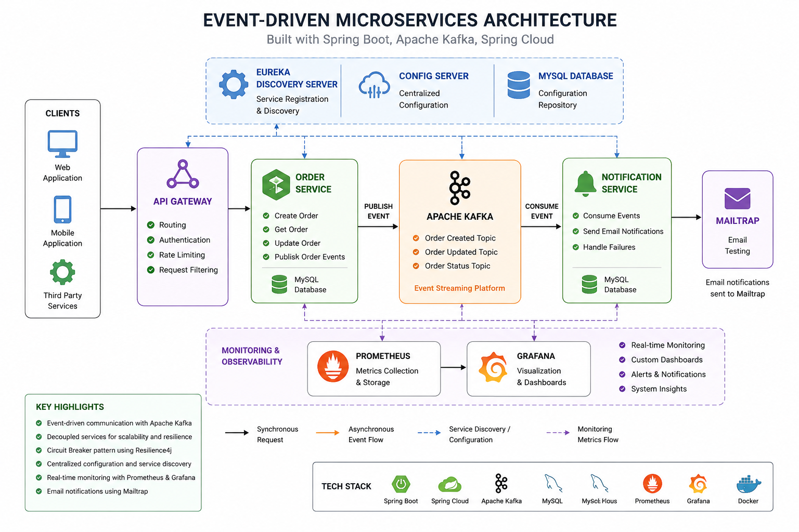
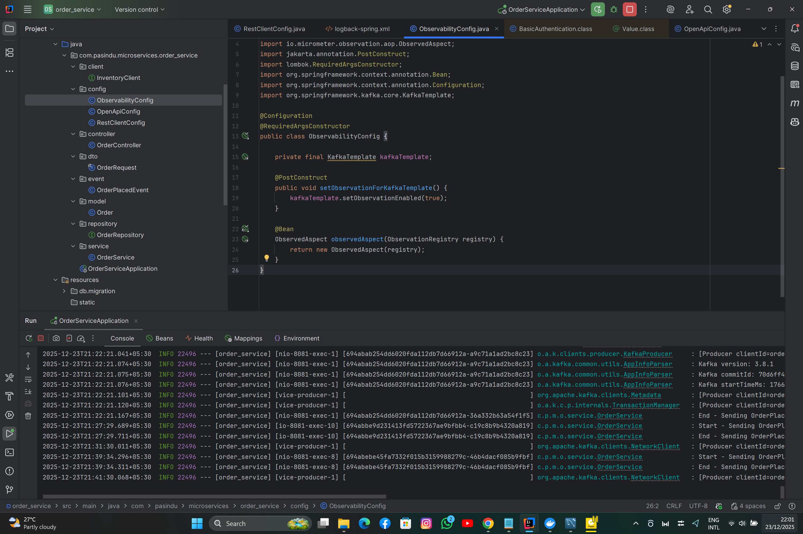
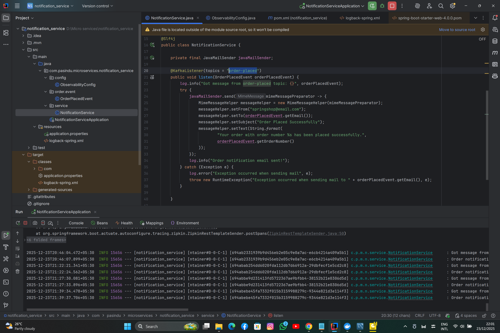
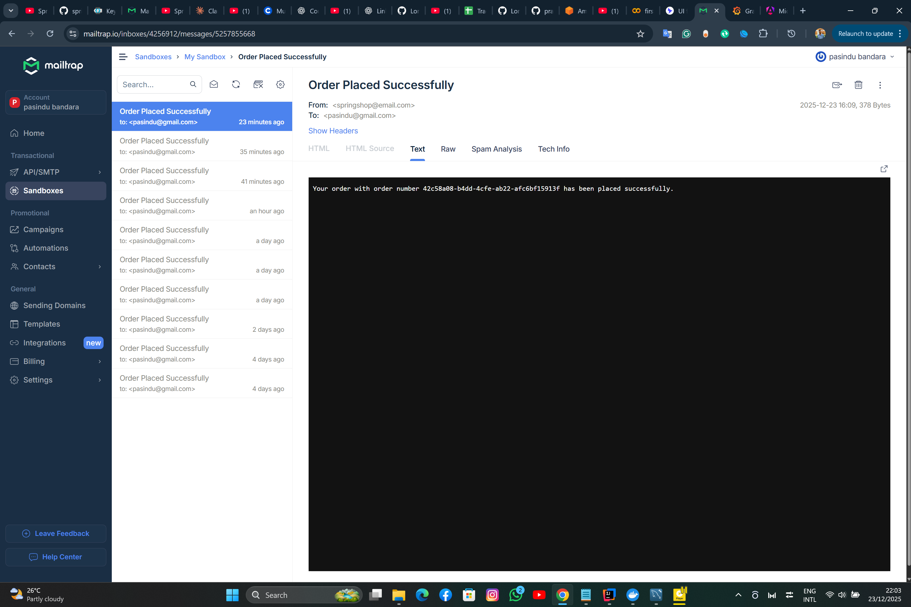
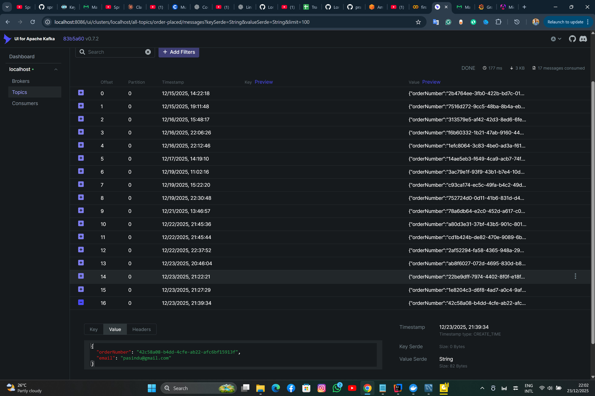
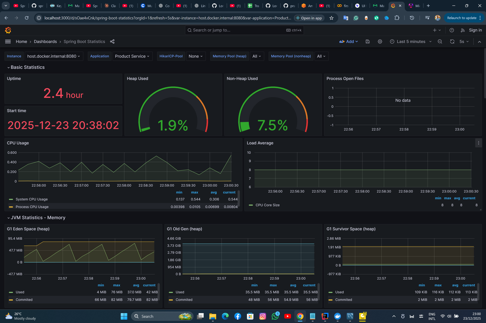
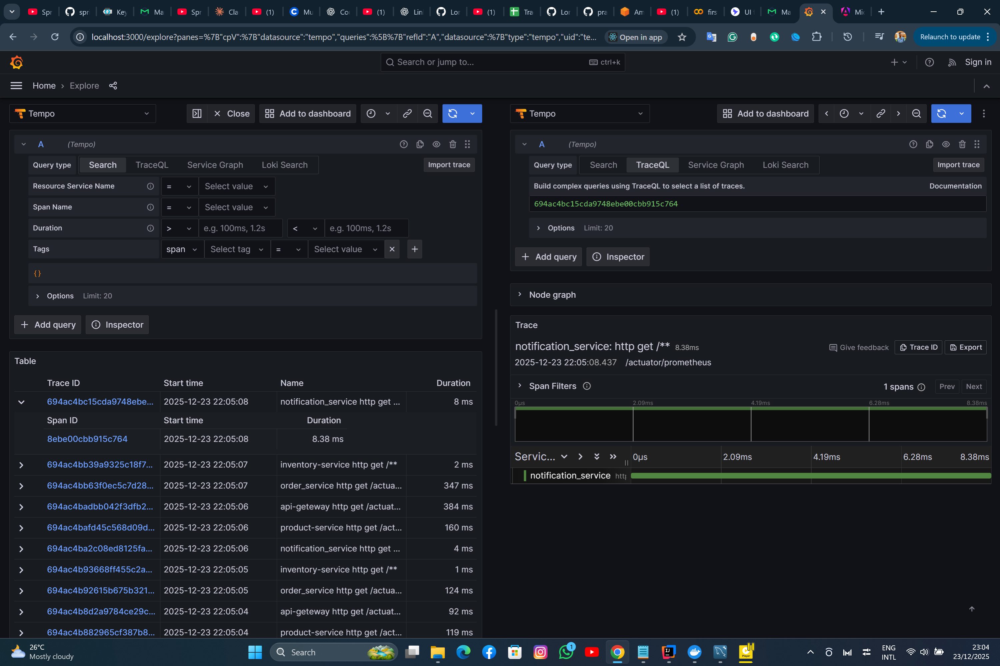

# 🚀 Event-Driven Microservices System

A scalable and resilient microservices architecture built using **Spring Boot**, **Apache Kafka**, **Spring Cloud**, **Resilience4j**, **Grafana**, and **Prometheus**.

This project demonstrates modern backend engineering concepts including:

- Event-Driven Architecture
- Distributed Microservices
- Circuit Breaker Pattern
- Observability & Monitoring
- Centralized Configuration
- Service Discovery
- Email Notifications
- Dockerized Deployment

---

# 🏗️ System Architecture

> Add your architecture diagram image here

```md

```

---

# ✨ Features

✅ Event-driven communication using Apache Kafka  
✅ Microservices architecture with Spring Boot  
✅ API Gateway implementation  
✅ Service Discovery using Eureka  
✅ Centralized Configuration Server  
✅ Circuit Breaker using Resilience4j  
✅ Real-time monitoring with Grafana & Prometheus  
✅ Email notifications using Mailtrap  
✅ Dockerized services  
✅ Fault-tolerant communication  

---

# 🛠️ Tech Stack

| Technology | Purpose |
|------------|----------|
| Java 17 | Backend Development |
| Spring Boot | Microservices Framework |
| Spring Cloud | Distributed System Support |
| Apache Kafka | Event Streaming |
| Eureka Server | Service Discovery |
| API Gateway | Request Routing |
| Resilience4j | Circuit Breaker |
| Prometheus | Metrics Collection |
| Grafana | Monitoring Dashboard |
| Mailtrap | Email Testing |
| Docker | Containerization |
| MySQL | Database |

---

# 📦 Microservices Overview

| Service | Description |
|----------|-------------|
| API Gateway | Central entry point for client requests |
| Discovery Server | Eureka service registry |
| Config Server | Centralized configuration management |
| Order Service | Handles order processing |
| Notification Service | Consumes Kafka events and sends emails |

---

# 🔄 Event-Driven Workflow

1. Client sends request through API Gateway  
2. Order Service processes the order  
3. Order event is published to Apache Kafka  
4. Notification Service consumes the event  
5. Email notification is sent using Mailtrap  

---

# 📸 Project Screenshots

## 🧾 Order Service

> Add Order Service screenshot

```md

```

---

## 📩 Notification Service

> Add Notification Service screenshot

```md

```

---

## 📨 Mailtrap Email Notifications

> Add Mailtrap screenshot

```md

```

---

## ⚡ Apache Kafka Event Streaming

> Add Kafka screenshot

```md

```

---

# 🛡️ Circuit Breaker Implementation

Implemented using **Resilience4j** to prevent cascading failures and improve system reliability.

### Features
- Fault tolerance
- Fallback mechanisms
- Service resilience
- Failure recovery

📖 Medium Article:  
https://medium.com/@pasiya10975/circuit-breaker-in-microservices-ca20d2fb0878

---

# 📊 Observability & Monitoring

Integrated **Prometheus** and **Grafana** for monitoring application health and metrics.

### Monitoring Includes
- JVM Metrics
- API Request Metrics
- Service Health
- System Performance
- Real-time Dashboards

---

## 📈 Grafana Dashboard

> Add Grafana dashboard screenshot

```md

```

---

## 📉 Prometheus Metrics

> Add Prometheus screenshot

```md

```

---

# 🐳 Docker Setup

## Run the Project

```bash
git clone https://github.com/pasiya2021/Micro-services.git

cd Micro-services

docker-compose up
```

---

# 📂 Project Structure

```bash
Micro-services/
│
├── api-gateway/
├── config-server/
├── discovery-server/
├── order-service/
├── notification-service/
├── docker-compose.yml
│
└── README.md
```

---

# 🔗 Medium Articles

## 📝 Building an Event-Driven Microservices System

https://medium.com/@pasiya10975/building-an-event-driven-microservices-system-using-kafka-and-spring-boot-acc9a20f4d96

---

## 🛡️ Circuit Breaker in Microservices

https://medium.com/@pasiya10975/circuit-breaker-in-microservices-ca20d2fb0878

---

## 📊 Observability in Microservices using Grafana & Prometheus

https://medium.com/@pasiya10975/observability-in-microservices-using-grafana-prometheus-spring-boot-7ea3c5bdef2c

---

# 🚀 Future Improvements

- Kubernetes Deployment
- Distributed Tracing
- CI/CD Pipeline
- Authentication & Authorization
- Advanced Monitoring
- Load Balancing

---

# 👨‍💻 Author

## Pasindu Bandara

Software Engineering Undergraduate passionate about:
- Microservices
- Distributed Systems
- Backend Engineering
- Cloud Technologies
- Observability

GitHub:  
https://github.com/pasiya2021

LinkedIn:  
> Add your LinkedIn URL here

---

# ⭐ Support

If you found this project helpful, give it a ⭐ on GitHub!
